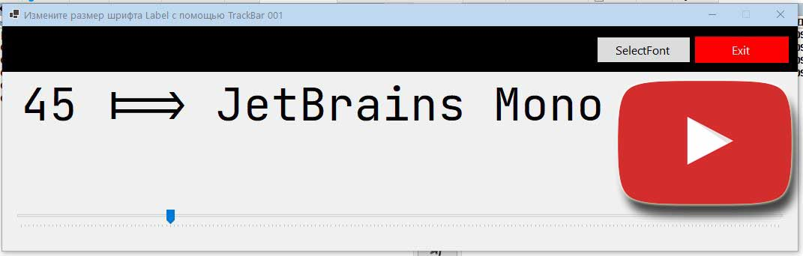

# Step-by-Step-Guide-to-Resizing-Font-with-TrackBar
## Простые методы настройки размера шрифта с помощью TrackBar…

> :point_right: В этом примере на языке C# мы покажем, как можно изменить размер шрифта в надписи с помощью элемента управления TrackBar. 
> 🔶 Наша задача — дать пользователю возможность выбирать размер шрифта для компонента Label, используя ползунок. 
> 🔶 Для этого мы будем использовать элемент управления TrackBar, который позволяет изменять размер шрифта в текстовом поле. 
> :point_right: Мы установили свойства  и  элемента управления TrackBar **на значения 5 и 200**, чтобы пользователь мог выбирать только шрифты в этом диапазоне. 
> 🔴 Также мы используем конструктор шрифта, который принимает четыре аргумента. В нашем случае мы передаём текущие настройки семейства, стиля и единицы измерения шрифта, используемого в текстовом поле. Это позволяет сохранить текущие настройки при изменении размера шрифта. 
> 🔴 Второй аргумент конструктора задаёт размер нового шрифта. Для этого мы используем свойство  элемента управления TrackBar, чтобы получить значение, выбранное пользователем. 
>> ‼️ В этом примере мы продемонстрировали, как с помощью элемента управления TrackBar в C# можно изменять размер шрифта надписи. Мы использовали конструктор шрифта для сохранения текущих настроек и обеспечения корректного отображения текста при изменении размера. Это позволяет создать удобный интерфейс для пользователя, который может легко переключаться между различными размерами шрифта для компонента Label. 

[Верх](#anchor)
